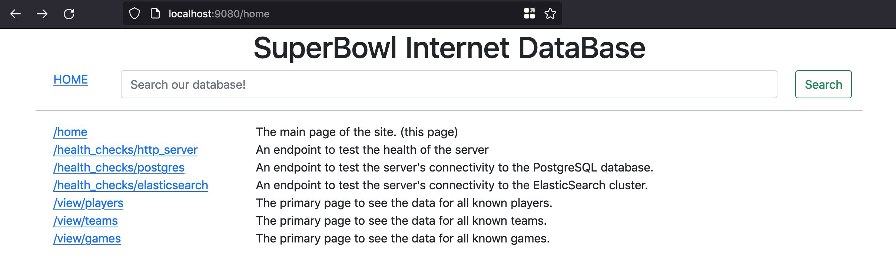
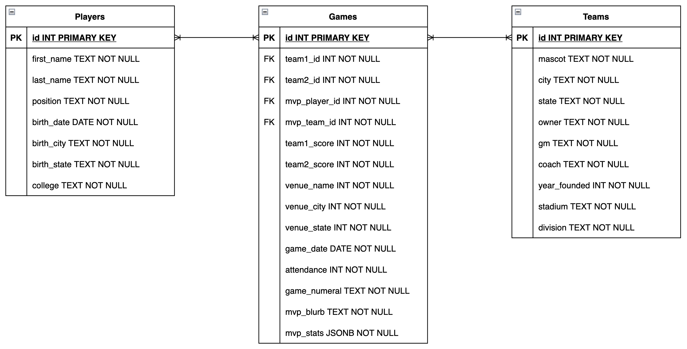
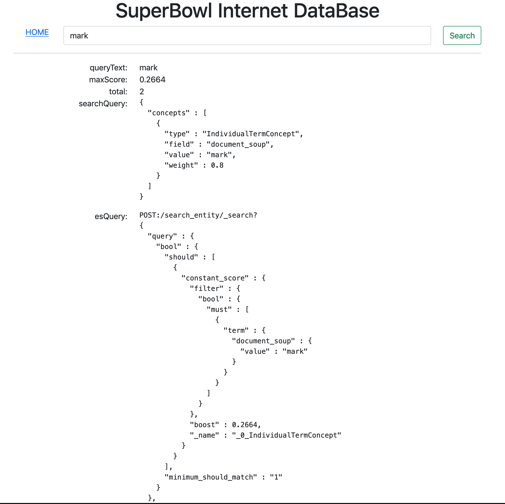
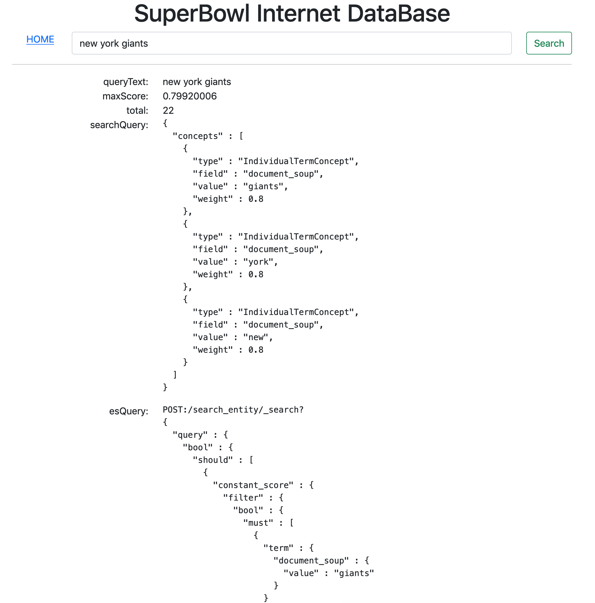
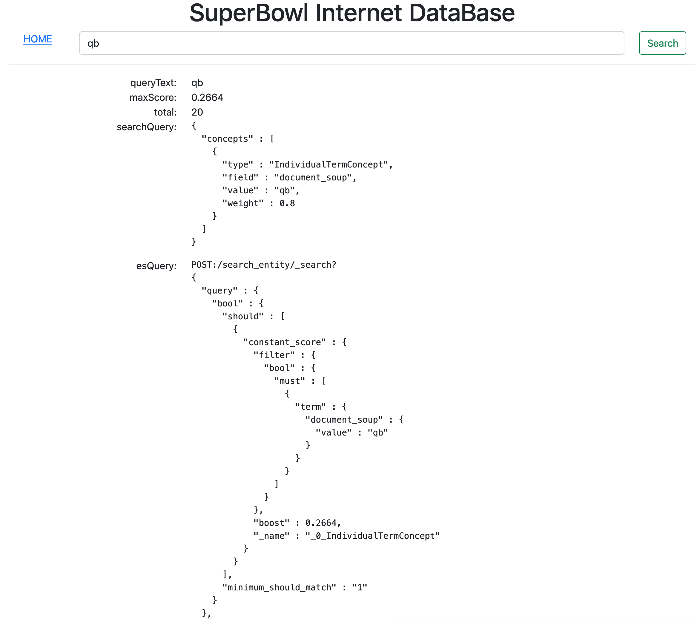
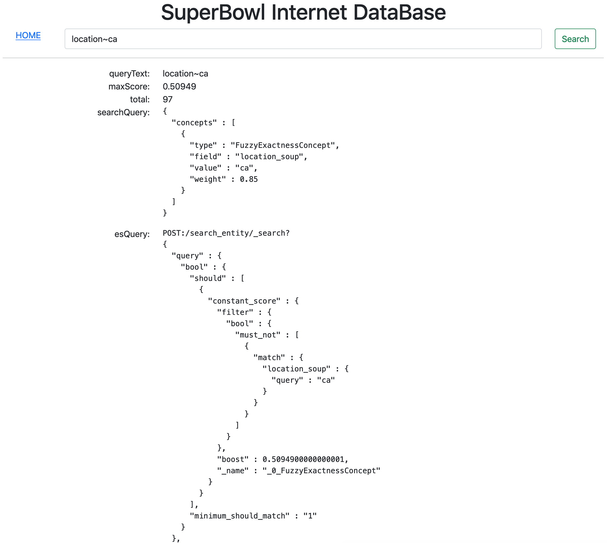

# SBIDB
The goal of this project is to demonstrate the integrations of various technologies 
to deliver a website similar to [IMDB.com](https://imdb.com) but oriented around 
the theme of the National Football League's SuperBowl games, the teams, and the 
players given the MVP (Most Valuable Player) award.



## Getting Started
The project is written in the Scala programming language and uses the SBT build system. 
To run the project ensure that a Java SDK (1.8 or better) is installed in your system 
along with SBT. Then clone this repository and execute `sbt run` in your terminal.

The project was developed on an Intel Macbook. Other operating systems or chipset 
architectures should work, but have not been tested. This project will boot-up an
HTTP server at port 9080, a PostgreSQL database at port 9432, and an ElasticSearch
cluster at port 9200. 

To summarize:
```shell
git clone https://github.com/yoday/sbidb-allinone.git
cd sbidb-allinone
sbt run
```

## Architecture
To deliver on the goal of being a "SuperBowl Internet DataBase", this website needs
to provide 1) a navigable user interface, 2) textual search capabilities, and 3) 
aggregate analysis and statistics reporting.

For the sake of simplicity, feature #1 is implemented as simple, sever-side rendered
web pages. Feature #3 is not implemented at this time, but it would be done by building
a reporting engine that uses a combination of SQL and ElasticSearch aggregations. 

Feature #2 is implemented by a custom search engine that analyzes the query text to find 
the most relevant page.

## Technologies

### PostgreSQL
The system of record is a PostgreSQL database due to its reliability, rich feature set,
and performance. To make this project easy to demo, we use the `embedded-postgres` library
that handles the download, setup, boot, and configuration of the sql database.

### ElasticSearch
There are various search technologies that we can leverage to build a search system
on, but ElasticSearch's flexibility, tuneability, and ease of use helps a lot. Like with
PostgreSQL, we use the `embedded-elasticsearch` library to make it easy to download, 
setup, boot, and configure an ElasticSearch cluster.

### ZIO and Scala
ZIO is a high performance effect system that allows us to write type-safe, 
functional-oriented code. This means that we can better control the execution of effectual 
computations and have easily testable and robust components.

## Data Modeling
We use 3 entities to model the data about the SuperBowl games. A `Player` entity holds
information about a person that received the MVP award in at least one game. Players 
that participated a SuperBowl game but have not won an MVP award are not tracked in this
database. A `Team` entity holds the latest information about the franchise that participated 
in at least one SuperBowl game. The `Game` entity captures a SuperBowl event and the 
relationships of the Teams and Players that participated. 



## Search Engine
The search engine works by breaking down a query string into a series of text tokens and
process them, either individually or in groups, using a variety of strategies to determine
the intent of the search.

### Examples:

Search by name



Search by location



Search by position



Exclude exact matches of "ca" in the location category.


Include exact matches of "ca" in the location category.


Include fuzzy matches of "ca" in the location category.

